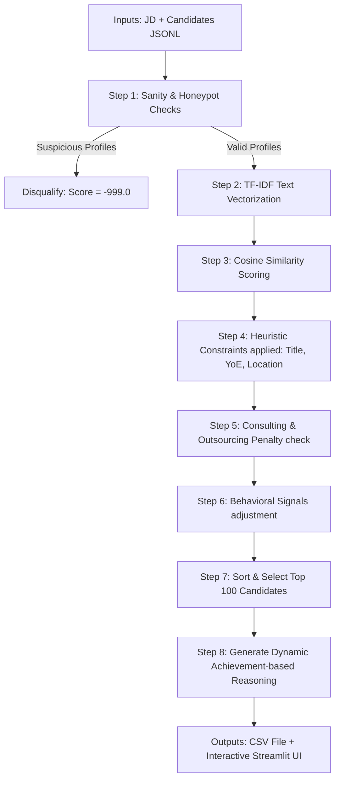

# Redrob Intelligent Candidate Discovery & Ranking

This repository contains the ranking system developed for the **Intelligent Candidate Discovery & Ranking Challenge** to identify the top 100 candidates for a **Senior AI Engineer — Founding Team** role.

## Setup Instructions

1. **Clone the repository**:
   ```bash
   git clone https://github.com/PalSoham/redrob-hackathon
   cd redrob-hackathon
   ```

2. **Install dependencies**:
   Ensure Python 3.10+ is installed, then run:
   ```bash
   pip install -r requirements.txt
   ```

3. **Prepare Candidate Data**:
   Place the extracted `candidates.jsonl` file in the repository root (or specify its path when running the script).

---

## Reproduce Submission

Run the following command to execute the ranking system and generate the submission CSV:

```bash
python rank.py --candidates ./candidates.jsonl --out ./hard_coder.csv
```

### Constraints Met:
*   **Total Runtime**: ~39 seconds (Limit: 5 minutes)
*   **RAM consumption**: ~150 MB (Limit: 16 GB)
*   **GPU usage**: None (Runs entirely on CPU)
*   **Internet Access**: None (Completely local and offline)

---

## Methodology



This ranker leverages a hybrid approach combining **TF-IDF Semantic Matching**, **Heuristic Multi-Criteria Scoring**, and **Platform Behavioral Signals**:

1. **Honeypot Exclusion**: Checks each candidate for physical impossibilities:
   * Skills marked as `expert` but having `duration_months == 0`.
   * Stated duration of any individual job exceeding the candidate's total profile years of experience.
   * Stated years of experience exceeding the timeframe since the start of their earliest job.
   * Flagged honeypots receive a score of `-999.0` to guarantee zero presence in the top 100.
2. **Semantic Matching (TF-IDF)**: Computes a term-frequency cosine similarity score between the Job Description text and a combined candidate text profile (headline + summary + skills + career history descriptions). This accounts for **50% of the base score**.
3. **Core Scorer Criteria**:
   * **Title Relevance** (20% weight): Targets engineering/ML titles.
   * **Experience years** (20% weight): Targets 5-9 years.
   * **Location/Relocation** (10% weight): Noida/Pune hybrid match gets 1.0, other Indian cities with relocation get 0.8, international candidates get heavily penalized.
4. **Behavioral Multipliers**: Base scores are adjusted by:
   * Recruiter response rate.
   * Active date recency.
   * Interview completion rate.
   * Stated notice period (under 30 days receives a multiplier).
5. **Consulting Company Filter**: Applies a severe penalty if all companies in the candidate's career history are consulting/services firms (TCS, Infosys, Wipro, etc.).
6. **Achievement-Based Reasoning Generator**: Automatically clean duplicates (e.g. "Senior Senior") and extract actual achievements from work description (e.g. "built RAG systems at company X") to produce unique, high-quality recruiter justifications.
